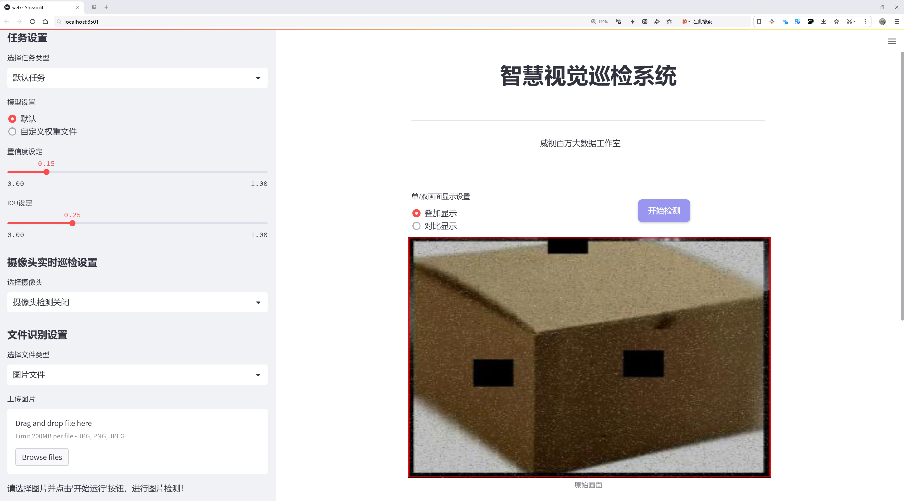
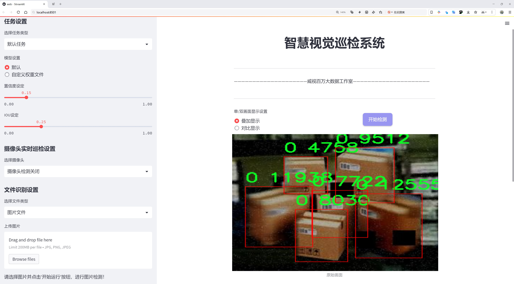
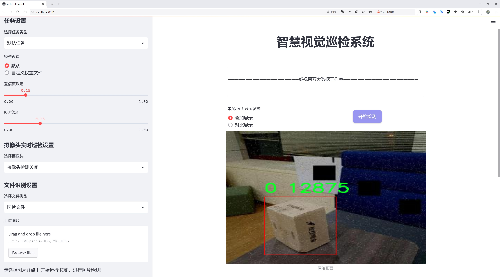
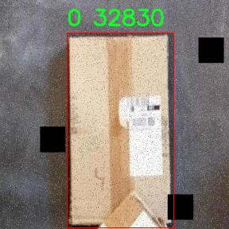
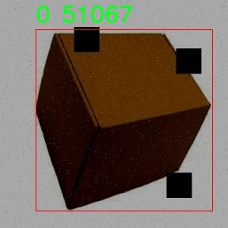
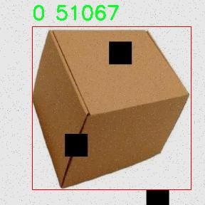
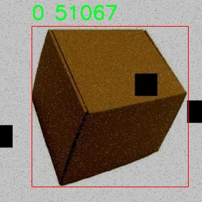
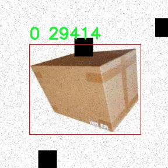

# 快递盒检测检测系统源码分享
 # [一条龙教学YOLOV8标注好的数据集一键训练_70+全套改进创新点发刊_Web前端展示]

### 1.研究背景与意义

项目参考[AAAI Association for the Advancement of Artificial Intelligence](https://gitee.com/qunmasj/projects)

项目来源[AACV Association for the Advancement of Computer Vision](https://github.com/qunshansj/good)

研究背景与意义

随着电子商务的迅猛发展，快递行业也随之蓬勃兴起，成为现代物流体系中不可或缺的一部分。根据统计数据，全球快递包裹的数量每年以惊人的速度增长，尤其是在“双十一”等购物节期间，快递包裹的处理量更是达到顶峰。这一现象不仅给快递公司带来了巨大的业务压力，也对快递包裹的管理和处理提出了更高的要求。在这一背景下，如何高效、准确地对快递包裹进行检测和分类，成为了一个亟待解决的问题。

传统的快递包裹检测方法多依赖人工操作，效率低下且容易出错。随着计算机视觉技术的快速发展，基于深度学习的目标检测算法逐渐成为解决这一问题的有效手段。YOLO（You Only Look Once）系列算法因其高效性和实时性，已被广泛应用于各类目标检测任务中。YOLOv8作为该系列的最新版本，具备了更强的特征提取能力和更快的推理速度，为快递盒的自动检测提供了新的可能性。

本研究旨在基于改进的YOLOv8模型，构建一个高效的快递盒检测系统。该系统将利用一个包含3064张图像的数据集，专注于对快递盒这一单一类别的检测。这一数据集的构建，旨在为模型的训练和评估提供充分的样本支持，确保检测系统在实际应用中的可靠性和准确性。通过对YOLOv8模型的改进，我们希望能够提升其在快递盒检测任务中的性能，特别是在复杂环境下的检测能力，如不同光照条件、遮挡情况等。

本研究的意义不仅在于技术层面的创新，更在于其对快递行业的实际应用价值。通过引入智能化的检测系统，快递公司可以显著提高包裹处理的效率，降低人工成本，减少人为错误。此外，自动化的检测系统还能够提升快递物流的透明度和可追溯性，为消费者提供更好的服务体验。

在未来，随着技术的不断进步和数据集的不断丰富，我们的快递盒检测系统有望扩展到更多的应用场景，如仓储管理、配送路径优化等。这将为整个快递行业的智能化转型提供有力支持，推动物流行业的可持续发展。因此，本研究不仅具有重要的学术价值，也为快递行业的实践应用提供了切实可行的解决方案，具有广泛的社会和经济意义。

### 2.图片演示







##### 注意：由于此博客编辑较早，上面“2.图片演示”和“3.视频演示”展示的系统图片或者视频可能为老版本，新版本在老版本的基础上升级如下：（实际效果以升级的新版本为准）

  （1）适配了YOLOV8的“目标检测”模型和“实例分割”模型，通过加载相应的权重（.pt）文件即可自适应加载模型。

  （2）支持“图片识别”、“视频识别”、“摄像头实时识别”三种识别模式。

  （3）支持“图片识别”、“视频识别”、“摄像头实时识别”三种识别结果保存导出，解决手动导出（容易卡顿出现爆内存）存在的问题，识别完自动保存结果并导出到tempDir中。

  （4）支持Web前端系统中的标题、背景图等自定义修改，后面提供修改教程。

  另外本项目提供训练的数据集和训练教程,暂不提供权重文件（best.pt）,需要您按照教程进行训练后实现图片演示和Web前端界面演示的效果。

### 3.视频演示

[3.1 视频演示](https://www.bilibili.com/video/BV1S2HVevEHR/?vd_source=ff015de2d29cbe2a9cdbfa7064407a08)

### 4.数据集信息展示

数据集信息展示

在本研究中，我们采用了名为“ParcelDetection”的数据集，以训练和改进YOLOv8模型在快递盒检测任务中的表现。该数据集专门针对快递盒的识别与定位，旨在提升自动化物流处理系统的效率和准确性。数据集的设计考虑到了快递盒在实际应用场景中的多样性与复杂性，确保模型能够在各种环境下进行有效的检测。

“ParcelDetection”数据集的类别数量为1，具体类别列表仅包含一个类别，即“0”。这一设计反映了快递盒检测任务的专一性，意味着所有的标注数据均围绕快递盒这一目标展开。这种简化的类别设置有助于模型专注于快递盒的特征提取与学习，减少了在多类别检测中可能出现的混淆与干扰，从而提高了检测的精度与效率。

数据集的构建过程中，包含了大量不同场景下的快递盒图像，涵盖了各种尺寸、形状、颜色及包装材料的快递盒。这些图像不仅来自于室内环境，如仓库、快递中心等，也包括了室外环境，如快递投递场所、街道等。这种多样化的图像来源使得数据集在训练过程中能够有效模拟现实世界中快递盒的多种表现形式，增强了模型的泛化能力。

在数据标注方面，所有快递盒的图像均经过专业人员的仔细标注，确保每个快递盒的边界框准确无误。这一过程不仅提升了数据集的质量，也为后续的模型训练提供了可靠的基础。标注信息的准确性对于YOLOv8模型的训练至关重要，因为模型的学习效果直接依赖于输入数据的质量和标注的精确度。

为了进一步提升模型的鲁棒性，数据集还采用了数据增强技术，包括随机裁剪、旋转、缩放、亮度调整等。这些技术能够有效增加训练样本的多样性，使得模型在面对不同的光照条件、视角变化及快递盒的不同状态时，依然能够保持较高的检测性能。

在训练过程中，我们将“ParcelDetection”数据集与YOLOv8模型相结合，旨在通过不断迭代优化模型参数，提升快递盒的检测准确率和速度。通过精细调节模型的超参数和网络结构，我们期望能够在快递盒检测任务中实现更高的精度和更快的响应时间，从而为实际应用提供更为高效的解决方案。

总之，“ParcelDetection”数据集为本研究提供了坚实的基础，通过对快递盒的精准标注和多样化的图像来源，结合先进的YOLOv8模型，我们相信能够在快递盒检测领域取得显著的进展，为未来的智能物流系统奠定良好的基础。











### 5.全套项目环境部署视频教程（零基础手把手教学）

[5.1 环境部署教程链接（零基础手把手教学）](https://www.ixigua.com/7404473917358506534?logTag=c807d0cbc21c0ef59de5)


[5.2 安装Python虚拟环境创建和依赖库安装视频教程链接（零基础手把手教学）](https://www.ixigua.com/7404474678003106304?logTag=1f1041108cd1f708b01a)

### 6.手把手YOLOV8训练视频教程（零基础小白有手就能学会）

[6.1 环境部署教程链接（零基础手把手教学）](https://www.ixigua.com/7404477157818401292?logTag=d31a2dfd1983c9668658)

### 7.70+种全套YOLOV8创新点代码加载调参视频教程（一键加载写好的改进模型的配置文件）

[7.1 环境部署教程链接（零基础手把手教学）](https://www.ixigua.com/7404478314661806627?logTag=29066f8288e3f4eea3a4)

### 8.70+种全套YOLOV8创新点原理讲解（非科班也可以轻松写刊发刊，V10版本正在科研待更新）

由于篇幅限制，每个创新点的具体原理讲解就不一一展开，具体见下列网址中的创新点对应子项目的技术原理博客网址【Blog】：


[8.1 70+种全套YOLOV8创新点原理讲解链接](https://gitee.com/qunmasj/good)

### 9.系统功能展示（检测对象为举例，实际内容以本项目数据集为准）

图9.1.系统支持检测结果表格显示

  图9.2.系统支持置信度和IOU阈值手动调节

  图9.3.系统支持自定义加载权重文件best.pt(需要你通过步骤5中训练获得)

  图9.4.系统支持摄像头实时识别

  图9.5.系统支持图片识别

  图9.6.系统支持视频识别

  图9.7.系统支持识别结果文件自动保存

  图9.8.系统支持Excel导出检测结果数据


### 10.原始YOLOV8算法原理

原始YOLOv8算法原理

YOLOv8作为YOLO系列的最新版本，自2023年发布以来，迅速在计算机视觉领域中崭露头角，成为目标检测、分类和分割任务的领先模型。其设计理念基于前几代YOLO模型的成功经验，融合了多种先进技术，使得YOLOv8在推理速度、检测精度、训练便利性以及硬件兼容性等方面均表现出色。

YOLOv8的网络结构由三部分组成：Backbone（骨干网络）、Neck（颈部结构）和Head（头部结构）。Backbone负责特征提取，Neck则用于特征融合，而Head则是模型输出检测信息的关键部分。具体而言，Backbone采用了CSP（Cross Stage Partial）结构，旨在通过将特征提取过程分为多个阶段来提高网络的表达能力。CSP结构通过将特征图分为两部分，分别进行卷积和连接，有效地增强了模型的特征学习能力，同时降低了计算复杂度。

在YOLOv8中，Neck部分采用了PAN-FPN（Path Aggregation Network - Feature Pyramid Network）结构，这一设计使得多尺度特征的融合更加高效。PAN-FPN通过不同层次的特征图进行信息的整合，确保了模型在处理不同大小目标时的鲁棒性。此结构不仅提升了小目标的检测能力，还优化了高分辨率图像的处理效果，使得YOLOv8在多种应用场景中都能表现出色。

YOLOv8的Head部分则是其创新的核心所在。与之前版本的耦合头不同，YOLOv8引入了解耦头结构，这一结构使得分类和回归任务可以独立进行，从而提高了检测的精度和效率。此外，YOLOv8采用了Anchor-Free的检测方式，摆脱了传统Anchor-Based方法的限制，简化了模型的设计和训练过程。通过这种方式，YOLOv8能够更灵活地适应不同类型的目标，尤其是在复杂场景下的表现尤为突出。

在损失函数方面，YOLOv8使用了CloU（Class-Object Loss），这一损失函数在训练过程中有效地平衡了分类和回归的损失，进一步提升了模型的整体性能。通过对损失函数的优化，YOLOv8在训练过程中能够更快地收敛，减少了过拟合的风险，从而提高了模型在测试集上的泛化能力。

值得一提的是，YOLOv8在模型设置上提供了灵活的调整选项，包括depth_factor、width_factor和ratio等参数。这些参数允许用户根据具体应用需求，调整模型的深度和宽度，从而在性能和计算资源之间找到最佳平衡。例如，depth_factor的设置可以直接影响模型的层数，而width_factor则控制了每层的通道数。这种灵活性使得YOLOv8能够在不同硬件平台上运行，满足从边缘设备到高性能服务器的多种需求。

在实际应用中，YOLOv8的优势不仅体现在其结构设计上，还包括其强大的训练和调整能力。通过原生支持自定义数据集，用户可以根据特定任务需求，快速构建和训练模型。此外，YOLOv8的推理速度极快，使得其在实时目标检测场景中表现尤为突出，这使得YOLOv8成为许多工业和学术界研究者的首选工具。

总的来说，YOLOv8的原始算法原理通过对网络结构的精心设计和创新，结合先进的特征提取、融合和输出机制，成功地提升了目标检测的性能。其在深度学习领域的应用潜力巨大，尤其是在复杂环境下的小目标检测和高分辨率图像处理方面，YOLOv8展现出了前所未有的能力。随着YOLOv8的不断发展和优化，未来其在计算机视觉领域的应用将更加广泛，推动着智能视觉技术的进步与普及。


### 11.项目核心源码讲解（再也不用担心看不懂代码逻辑）

#### 11.1 utils.py

以下是经过精简和注释的核心代码部分：

```python
import os
import cv2
import pandas as pd
import streamlit as st
from PIL import Image
from QtFusion.path import abs_path

def save_uploaded_file(uploaded_file):
    """
    保存上传的文件到服务器上。

    Args:
        uploaded_file (UploadedFile): 通过Streamlit上传的文件。

    Returns:
        str: 保存文件的完整路径，如果没有文件上传则返回 None。
    """
    if uploaded_file is not None:  # 检查是否有文件上传
        base_path = "tempDir"  # 定义文件保存的基本路径

        # 如果路径不存在，创建这个路径
        if not os.path.exists(base_path):
            os.makedirs(base_path)

        # 获取文件的完整路径
        file_path = os.path.join(base_path, uploaded_file.name)

        # 以二进制写模式打开文件并写入
        with open(file_path, "wb") as f:
            f.write(uploaded_file.getbuffer())  # 写入文件内容

        return file_path  # 返回文件路径

    return None  # 如果没有文件上传，返回 None


def concat_results(result, location, confidence, time):
    """
    显示检测结果。

    Args:
        result (str): 检测结果。
        location (str): 检测位置。
        confidence (str): 置信度。
        time (str): 检测用时。

    Returns:
        DataFrame: 包含检测结果的 DataFrame。
    """
    # 创建一个包含检测信息的 DataFrame
    result_data = {
        "识别结果": [result],
        "位置": [location],
        "置信度": [confidence],
        "用时": [time]
    }

    results_df = pd.DataFrame(result_data)  # 将字典转换为 DataFrame
    return results_df  # 返回结果 DataFrame


def get_camera_names():
    """
    获取可用摄像头名称列表。

    Returns:
        list: 返回包含“未启用摄像头”和可用摄像头索引号的列表。
    """
    camera_names = ["摄像头检测关闭", "0"]  # 初始化摄像头名称列表
    max_test_cameras = 10  # 定义要测试的最大摄像头数量

    for i in range(max_test_cameras):
        cap = cv2.VideoCapture(i, cv2.CAP_DSHOW)  # 尝试打开摄像头
        if cap.isOpened():  # 如果摄像头成功打开
            camera_names.append(str(i))  # 添加摄像头索引到列表
            cap.release()  # 释放摄像头资源

    if len(camera_names) == 1:  # 如果没有找到可用摄像头
        st.write("未找到可用的摄像头")  # 提示信息

    return camera_names  # 返回摄像头名称列表
```

### 代码说明：
1. **save_uploaded_file**: 该函数用于保存用户上传的文件。如果上传了文件，它会创建一个目录并将文件保存到该目录中，最后返回文件的完整路径。
   
2. **concat_results**: 该函数用于将检测结果、位置、置信度和用时等信息整理成一个 Pandas DataFrame，方便后续处理和展示。

3. **get_camera_names**: 该函数用于检测可用的摄像头，并返回一个包含摄像头名称的列表。如果没有找到可用的摄像头，会给出相应的提示。

这个 `utils.py` 文件包含了一些用于处理文件上传、显示检测结果、加载默认图片以及获取可用摄像头名称的实用函数。首先，文件导入了一些必要的库，包括 `os`、`cv2`、`pandas`、`streamlit`、`PIL` 和 `QtFusion.path`。

在文件中，`save_uploaded_file` 函数用于保存用户通过 Streamlit 上传的文件。该函数首先检查是否有文件被上传，如果有，则定义一个基本路径 `tempDir` 用于存储文件。如果该路径不存在，函数会创建它。接着，函数获取上传文件的完整路径，并以二进制写入模式打开文件，将文件内容写入指定路径。最后，函数返回保存文件的完整路径，如果没有文件上传，则返回 `None`。

接下来，`concat_results` 函数用于显示检测结果。它接收检测结果、位置、置信度和检测用时作为参数，并将这些信息组织成一个字典，然后使用 `pandas` 创建一个 DataFrame，最终返回这个 DataFrame。

`load_default_image` 函数用于加载一个默认的图片。它通过调用 `abs_path` 函数获取默认图片的绝对路径，并使用 `PIL` 的 `Image.open` 方法打开并返回这个图片对象。

最后，`get_camera_names` 函数用于获取可用摄像头的名称列表。它初始化一个包含“摄像头检测关闭”和索引“0”的列表，并定义了一个最大测试摄像头数量的上限。函数通过循环尝试打开多个摄像头，如果成功打开，则将其索引添加到列表中。如果没有找到可用的摄像头，函数会在 Streamlit 界面上显示一条消息。最终，函数返回可用摄像头的名称列表。

整体来看，这个文件提供了一些基础的功能，便于在一个基于 Streamlit 的应用中处理文件上传、展示检测结果、加载图片以及管理摄像头。

#### 11.2 ui.py

```python
import sys
import subprocess

def run_script(script_path):
    """
    使用当前 Python 环境运行指定的脚本。

    Args:
        script_path (str): 要运行的脚本路径

    Returns:
        None
    """
    # 获取当前 Python 解释器的路径
    python_path = sys.executable

    # 构建运行命令，使用 streamlit 运行指定的脚本
    command = f'"{python_path}" -m streamlit run "{script_path}"'

    # 执行命令并等待其完成
    result = subprocess.run(command, shell=True)
    
    # 检查命令执行结果，如果返回码不为0，则表示出错
    if result.returncode != 0:
        print("脚本运行出错。")


# 实例化并运行应用
if __name__ == "__main__":
    # 指定要运行的脚本路径
    script_path = "web.py"  # 这里可以直接指定脚本名

    # 调用函数运行脚本
    run_script(script_path)
```

### 代码核心部分及注释说明：

1. **导入模块**：
   - `import sys`：用于访问与 Python 解释器紧密相关的变量和函数。
   - `import subprocess`：用于执行外部命令和程序。

2. **定义 `run_script` 函数**：
   - 该函数接受一个参数 `script_path`，表示要运行的 Python 脚本的路径。
   - 使用 `sys.executable` 获取当前 Python 解释器的路径，以确保使用正确的 Python 环境。
   - 构建一个命令字符串，使用 `streamlit` 模块运行指定的脚本。
   - 使用 `subprocess.run` 执行命令，并等待其完成。
   - 检查命令的返回码，如果不为0，表示脚本运行出错，并打印错误信息。

3. **主程序入口**：
   - 使用 `if __name__ == "__main__":` 确保该代码块仅在直接运行脚本时执行。
   - 指定要运行的脚本路径 `script_path`，这里可以直接使用脚本名。
   - 调用 `run_script` 函数，传入脚本路径以执行该脚本。

这个程序文件名为 `ui.py`，其主要功能是通过当前的 Python 环境运行一个指定的脚本，具体是使用 Streamlit 来启动一个 web 应用。

首先，程序导入了几个必要的模块，包括 `sys`、`os` 和 `subprocess`。其中，`sys` 模块用于访问与 Python 解释器相关的变量和函数，`os` 模块提供了与操作系统交互的功能，而 `subprocess` 模块则用于创建新进程、连接到它们的输入/输出/错误管道，并获取它们的返回码。

接着，程序从 `QtFusion.path` 模块中导入了 `abs_path` 函数，这个函数的作用是获取文件的绝对路径。

在 `run_script` 函数中，程序接收一个参数 `script_path`，这个参数是要运行的脚本的路径。函数内部首先获取当前 Python 解释器的路径，接着构建一个命令字符串，这个命令使用 Streamlit 来运行指定的脚本。具体的命令格式是：`"{python_path}" -m streamlit run "{script_path}"`，其中 `python_path` 是当前 Python 解释器的路径，`script_path` 是传入的脚本路径。

然后，程序使用 `subprocess.run` 方法执行这个命令。该方法的 `shell=True` 参数表示在 shell 中执行命令。执行后，程序检查返回码，如果返回码不为 0，表示脚本运行出错，程序会打印出“脚本运行出错。”的提示信息。

最后，在文件的主程序部分（`if __name__ == "__main__":`），程序指定了要运行的脚本路径，这里使用 `abs_path("web.py")` 来获取 `web.py` 文件的绝对路径。然后调用 `run_script` 函数来运行这个脚本。

总的来说，这个程序的主要目的是通过当前的 Python 环境启动一个 Streamlit 应用，具体的应用脚本是 `web.py`。

#### 11.3 ultralytics\models\rtdetr\val.py

以下是代码中最核心的部分，并附上详细的中文注释：

```python
import torch
from ultralytics.data import YOLODataset
from ultralytics.models.yolo.detect import DetectionValidator
from ultralytics.utils import ops

class RTDETRDataset(YOLODataset):
    """
    RT-DETR数据集类，继承自YOLODataset类，专为实时检测和跟踪任务设计。
    """

    def __init__(self, *args, data=None, **kwargs):
        """初始化RTDETRDataset类，调用父类构造函数。"""
        super().__init__(*args, data=data, **kwargs)

    def load_image(self, i, rect_mode=False):
        """从数据集中加载索引为'i'的图像，返回图像及其调整后的尺寸。"""
        return super().load_image(i=i, rect_mode=rect_mode)

    def build_transforms(self, hyp=None):
        """构建图像变换，主要用于评估阶段。"""
        if self.augment:
            # 根据是否使用增强来设置mosaic和mixup参数
            hyp.mosaic = hyp.mosaic if self.augment and not self.rect else 0.0
            hyp.mixup = hyp.mixup if self.augment and not self.rect else 0.0
            transforms = v8_transforms(self, self.imgsz, hyp, stretch=True)
        else:
            transforms = Compose([])  # 如果不使用增强，则不添加任何变换
        
        # 添加格式化变换
        transforms.append(
            Format(
                bbox_format="xywh",  # 边界框格式为xywh
                normalize=True,  # 归一化
                return_mask=self.use_segments,  # 是否返回分割掩码
                return_keypoint=self.use_keypoints,  # 是否返回关键点
                batch_idx=True,  # 返回批次索引
                mask_ratio=hyp.mask_ratio,  # 掩码比例
                mask_overlap=hyp.overlap_mask,  # 掩码重叠
            )
        )
        return transforms


class RTDETRValidator(DetectionValidator):
    """
    RTDETRValidator类扩展了DetectionValidator类，提供专门针对RT-DETR模型的验证功能。
    """

    def build_dataset(self, img_path, mode="val", batch=None):
        """
        构建RTDETR数据集。

        Args:
            img_path (str): 图像文件夹路径。
            mode (str): 模式（训练或验证），用户可以为每种模式自定义不同的增强。
            batch (int, optional): 批次大小，仅适用于矩形模式。默认为None。
        """
        return RTDETRDataset(
            img_path=img_path,
            imgsz=self.args.imgsz,
            batch_size=batch,
            augment=False,  # 不使用增强
            hyp=self.args,
            rect=False,  # 不使用矩形模式
            cache=self.args.cache or None,
            prefix=colorstr(f"{mode}: "),
            data=self.data,
        )

    def postprocess(self, preds):
        """对预测输出应用非极大值抑制（NMS）。"""
        bs, _, nd = preds[0].shape  # 获取批次大小、通道数和预测框数量
        bboxes, scores = preds[0].split((4, nd - 4), dim=-1)  # 分离边界框和分数
        bboxes *= self.args.imgsz  # 将边界框缩放到原始图像大小
        outputs = [torch.zeros((0, 6), device=bboxes.device)] * bs  # 初始化输出列表
        
        for i, bbox in enumerate(bboxes):  # 遍历每个边界框
            bbox = ops.xywh2xyxy(bbox)  # 将xywh格式转换为xyxy格式
            score, cls = scores[i].max(-1)  # 获取每个边界框的最大分数和对应类别
            pred = torch.cat([bbox, score[..., None], cls[..., None]], dim=-1)  # 合并边界框、分数和类别
            pred = pred[score.argsort(descending=True)]  # 按照分数降序排序
            outputs[i] = pred  # 保存预测结果

        return outputs

    def _prepare_batch(self, si, batch):
        """准备训练或推理的批次，应用变换。"""
        idx = batch["batch_idx"] == si  # 获取当前批次的索引
        cls = batch["cls"][idx].squeeze(-1)  # 获取当前批次的类别
        bbox = batch["bboxes"][idx]  # 获取当前批次的边界框
        ori_shape = batch["ori_shape"][si]  # 获取原始图像的形状
        imgsz = batch["img"].shape[2:]  # 获取图像的尺寸
        ratio_pad = batch["ratio_pad"][si]  # 获取填充比例
        
        if len(cls):
            bbox = ops.xywh2xyxy(bbox)  # 将目标框从xywh转换为xyxy格式
            bbox[..., [0, 2]] *= ori_shape[1]  # 将边界框的x坐标转换为原始空间
            bbox[..., [1, 3]] *= ori_shape[0]  # 将边界框的y坐标转换为原始空间
        
        return dict(cls=cls, bbox=bbox, ori_shape=ori_shape, imgsz=imgsz, ratio_pad=ratio_pad)

    def _prepare_pred(self, pred, pbatch):
        """准备并返回带有变换后的边界框和类别标签的批次。"""
        predn = pred.clone()  # 克隆预测结果
        predn[..., [0, 2]] *= pbatch["ori_shape"][1] / self.args.imgsz  # 将边界框的x坐标转换为原始空间
        predn[..., [1, 3]] *= pbatch["ori_shape"][0] / self.args.imgsz  # 将边界框的y坐标转换为原始空间
        return predn.float()  # 返回浮点型的预测结果
```

### 代码核心部分说明：
1. **RTDETRDataset** 类：
   - 继承自 `YOLODataset`，用于处理RT-DETR模型的数据集。
   - 主要功能包括加载图像、构建图像变换等。

2. **RTDETRValidator** 类：
   - 继承自 `DetectionValidator`，提供RT-DETR模型的验证功能。
   - 包含构建数据集、后处理预测结果、准备批次和准备预测等方法。

3. **后处理方法**：
   - `postprocess` 方法中应用了非极大值抑制（NMS），用于过滤重叠的边界框。

4. **批次准备**：
   - `_prepare_batch` 和 `_prepare_pred` 方法用于准备训练或推理的批次数据，确保边界框和类别标签的正确格式和比例。

该程序文件是用于实现RT-DETR（实时检测与跟踪）模型的验证功能，主要包含两个类：`RTDETRDataset`和`RTDETRValidator`。`RTDETRDataset`类继承自YOLODataset类，专门为RT-DETR模型设计，优化了实时检测和跟踪任务。该类的构造函数调用了父类的构造函数，并重写了`load_image`方法以加载图像，同时提供了`build_transforms`方法来构建图像转换操作，这些转换可以在评估过程中使用。

在`RTDETRValidator`类中，继承自`DetectionValidator`类，提供了专门针对RT-DETR模型的验证能力。该类能够构建RT-DETR特定的数据集，并在后处理阶段应用非极大值抑制（NMS）来处理预测结果，同时更新评估指标。`build_dataset`方法用于构建数据集，接收图像路径、模式（训练或验证）和批次大小作为参数。`postprocess`方法则对预测结果应用NMS，处理后返回经过过滤的边界框和分类信息。

此外，`_prepare_batch`和`_prepare_pred`方法分别用于准备训练或推理的批次数据，以及对预测结果进行处理和转换，以便于后续的评估和分析。整个文件的设计旨在为RT-DETR模型提供高效的验证流程，确保模型在实际应用中的性能和准确性。

#### 11.4 ultralytics\models\sam\amg.py

以下是经过简化并添加详细中文注释的核心代码部分：

```python
import torch
import numpy as np

def is_box_near_crop_edge(
    boxes: torch.Tensor, crop_box: List[int], orig_box: List[int], atol: float = 20.0
) -> torch.Tensor:
    """
    判断给定的边界框是否接近裁剪边缘。

    参数：
    - boxes: 要检查的边界框，形状为 (N, 4)，每个框由 (x1, y1, x2, y2) 表示。
    - crop_box: 当前裁剪框的坐标 [x0, y0, x1, y1]。
    - orig_box: 原始图像的边界框坐标 [x0, y0, x1, y1]。
    - atol: 允许的绝对误差，默认为 20.0。

    返回：
    - 返回一个布尔张量，指示每个框是否接近裁剪边缘。
    """
    crop_box_torch = torch.as_tensor(crop_box, dtype=torch.float, device=boxes.device)
    orig_box_torch = torch.as_tensor(orig_box, dtype=torch.float, device=boxes.device)
    boxes = uncrop_boxes_xyxy(boxes, crop_box).float()  # 将框从裁剪空间转换到原始空间
    near_crop_edge = torch.isclose(boxes, crop_box_torch[None, :], atol=atol, rtol=0)  # 检查是否接近裁剪边缘
    near_image_edge = torch.isclose(boxes, orig_box_torch[None, :], atol=atol, rtol=0)  # 检查是否接近原始图像边缘
    near_crop_edge = torch.logical_and(near_crop_edge, ~near_image_edge)  # 仅保留接近裁剪边缘的框
    return torch.any(near_crop_edge, dim=1)  # 返回每个框是否接近裁剪边缘的布尔值

def uncrop_boxes_xyxy(boxes: torch.Tensor, crop_box: List[int]) -> torch.Tensor:
    """
    将裁剪框的边界框转换为原始图像坐标。

    参数：
    - boxes: 裁剪后的边界框，形状为 (N, 4)。
    - crop_box: 当前裁剪框的坐标 [x0, y0, x1, y1]。

    返回：
    - 返回转换后的边界框，形状为 (N, 4)。
    """
    x0, y0, _, _ = crop_box
    offset = torch.tensor([[x0, y0, x0, y0]], device=boxes.device)  # 计算偏移量
    if len(boxes.shape) == 3:  # 检查是否有通道维度
        offset = offset.unsqueeze(1)
    return boxes + offset  # 将偏移量加到边界框上

def calculate_stability_score(masks: torch.Tensor, mask_threshold: float, threshold_offset: float) -> torch.Tensor:
    """
    计算一批掩膜的稳定性得分。

    稳定性得分是通过对预测掩膜的 logits 进行高低阈值二值化后计算的 IoU。

    参数：
    - masks: 预测的掩膜，形状为 (N, H, W)。
    - mask_threshold: 阈值，用于二值化掩膜。
    - threshold_offset: 阈值偏移量。

    返回：
    - 返回每个掩膜的稳定性得分。
    """
    intersections = (masks > (mask_threshold + threshold_offset)).sum(-1, dtype=torch.int16).sum(-1, dtype=torch.int32)  # 计算交集
    unions = (masks > (mask_threshold - threshold_offset)).sum(-1, dtype=torch.int16).sum(-1, dtype=torch.int32)  # 计算并集
    return intersections / unions  # 返回 IoU 作为稳定性得分
```

### 代码说明：
1. **is_box_near_crop_edge**：该函数用于判断给定的边界框是否接近裁剪边缘。它通过比较裁剪框和原始框的坐标来确定框的位置。
  
2. **uncrop_boxes_xyxy**：该函数将裁剪后的边界框转换为原始图像坐标，通过添加裁剪框的偏移量来实现。

3. **calculate_stability_score**：该函数计算一批掩膜的稳定性得分，得分是通过计算二值化掩膜的交集和并集来得到的。

这些函数是图像处理和目标检测任务中非常核心的部分，主要用于处理边界框和掩膜的坐标转换与评估。

这个程序文件 `ultralytics\models\sam\amg.py` 是一个与目标检测和图像分割相关的模块，主要用于处理图像中的边界框、掩码和图像裁剪等操作。以下是对代码的详细讲解。

首先，文件引入了一些必要的库，包括数学库 `math`、迭代工具 `itertools.product`、类型提示库 `typing` 以及数值计算库 `numpy` 和深度学习框架 `torch`。这些库为后续的计算和数据处理提供了基础。

接下来，定义了多个函数。第一个函数 `is_box_near_crop_edge` 用于判断给定的边界框是否接近裁剪边缘。它接收边界框、裁剪框和原始框作为输入，并返回一个布尔张量，指示哪些边界框接近裁剪边缘。该函数通过将边界框转换为未裁剪的坐标，并与裁剪框和原始框进行比较来实现这一点。

`batch_iterator` 函数用于生成批量数据的迭代器。它确保所有输入参数的长度相同，并根据指定的批量大小生成数据批次。

`calculate_stability_score` 函数计算一组掩码的稳定性得分。稳定性得分是通过计算在高低阈值下二进制掩码的交并比（IoU）来获得的。

`build_point_grid` 函数生成一个二维网格，网格中的点均匀分布在 [0,1] x [0,1] 的范围内。`build_all_layer_point_grids` 函数则为所有裁剪层生成点网格，考虑了不同的缩放比例。

`generate_crop_boxes` 函数生成不同大小的裁剪框，基于输入图像的尺寸、层数和重叠比例。它通过计算每层的裁剪框数量和尺寸，生成一系列裁剪框。

`uncrop_boxes_xyxy`、`uncrop_points` 和 `uncrop_masks` 函数用于将裁剪后的边界框、点和掩码恢复到原始图像的坐标系中。这些函数通过添加裁剪框的偏移量来实现坐标转换。

`remove_small_regions` 函数用于去除掩码中的小区域或孔洞。它使用 OpenCV 库中的连通组件分析来识别和处理小区域，返回处理后的掩码和一个指示是否进行了修改的布尔值。

最后，`batched_mask_to_box` 函数计算掩码周围的边界框，返回的格式为 XYXY。该函数处理了空掩码的情况，并确保输出的形状与输入掩码的形状一致。

整体来看，这个模块提供了一系列用于图像处理和分析的工具，特别是在目标检测和分割任务中，帮助用户有效地处理和分析图像数据。

#### 11.5 train.py

以下是代码中最核心的部分，并附上详细的中文注释：

```python
import os
import torch
import yaml
from ultralytics import YOLO  # 导入YOLO模型库
from QtFusion.path import abs_path  # 导入路径处理函数

# 检测是否有可用的GPU，如果有则使用GPU，否则使用CPU
device = "0" if torch.cuda.is_available() else "cpu"

if __name__ == '__main__':  # 确保该模块被直接运行时才执行以下代码
    workers = 1  # 设置数据加载的工作进程数
    batch = 2    # 设置每个批次的大小

    data_name = "data"  # 数据集名称
    # 获取数据集yaml文件的绝对路径
    data_path = abs_path(f'datasets/{data_name}/{data_name}.yaml', path_type='current')  
    unix_style_path = data_path.replace(os.sep, '/')  # 将路径转换为Unix风格

    # 获取数据集目录路径
    directory_path = os.path.dirname(unix_style_path)
    
    # 读取YAML文件，保持原有顺序
    with open(data_path, 'r') as file:
        data = yaml.load(file, Loader=yaml.FullLoader)
    
    # 如果YAML文件中包含'path'项，则修改为当前目录路径
    if 'path' in data:
        data['path'] = directory_path
        # 将修改后的数据写回YAML文件
        with open(data_path, 'w') as file:
            yaml.safe_dump(data, file, sort_keys=False)

    # 加载预训练的YOLOv8模型
    model = YOLO(model='./ultralytics/cfg/models/v8/yolov8s.yaml', task='detect')  
    
    # 开始训练模型
    results2 = model.train(  
        data=data_path,  # 指定训练数据的配置文件路径
        device=device,  # 指定使用的设备（GPU或CPU）
        workers=workers,  # 指定使用的工作进程数
        imgsz=640,  # 指定输入图像的大小为640x640
        epochs=100,  # 指定训练的轮数为100
        batch=batch,  # 指定每个批次的大小
        name='train_v8_' + data_name  # 指定训练任务的名称
    )
```

### 代码注释说明：
1. **导入库**：导入必要的库，包括操作系统处理、PyTorch、YAML文件处理和YOLO模型。
2. **设备选择**：根据是否有可用的GPU来选择训练设备。
3. **数据集路径处理**：通过`abs_path`函数获取数据集的绝对路径，并转换为Unix风格的路径。
4. **读取和修改YAML文件**：读取数据集的配置文件，修改其中的路径项，并将修改后的内容写回文件。
5. **模型加载**：加载YOLOv8的预训练模型配置。
6. **模型训练**：调用`train`方法开始训练，传入数据路径、设备、工作进程数、图像大小、训练轮数、批次大小和任务名称等参数。

这个程序文件 `train.py` 是一个用于训练 YOLOv8 模型的脚本。首先，它导入了必要的库，包括 `os`、`torch`、`yaml` 和 `ultralytics` 中的 YOLO 模型。接着，程序会检查是否有可用的 GPU，如果有，则将设备设置为 GPU（"0"），否则使用 CPU。

在 `__main__` 块中，程序设置了一些训练参数，如工作进程数 `workers` 和批次大小 `batch`。然后，它定义了数据集的名称，这里使用的是 "data"，并构建了数据集 YAML 文件的绝对路径。通过调用 `abs_path` 函数，程序将路径转换为统一的 UNIX 风格路径，并获取其目录路径。

接下来，程序打开指定的 YAML 文件，读取其中的数据。它会检查 YAML 文件中是否包含 `path` 项，如果有，则将其修改为数据集的目录路径，并将更新后的数据写回 YAML 文件，以确保路径正确。

然后，程序加载了预训练的 YOLOv8 模型，指定了模型的配置文件路径和任务类型（目标检测）。在模型加载完成后，程序调用 `model.train()` 方法开始训练，传入训练所需的参数，包括数据配置文件路径、设备、工作进程数、输入图像大小（640x640）、训练的 epoch 数（100）以及训练任务的名称。

总的来说，这个脚本的主要功能是配置并启动 YOLOv8 模型的训练过程，确保数据路径正确，并设置了相关的训练参数。

#### 11.6 ultralytics\models\sam\__init__.py

以下是代码中最核心的部分，并附上详细的中文注释：

```python
# 导入所需的模块
from .model import SAM  # 从当前包的model模块中导入SAM类
from .predict import Predictor  # 从当前包的predict模块中导入Predictor类

# 定义当前模块的公开接口
__all__ = "SAM", "Predictor"  # 指定在使用from module import *时，允许导入的类
```

### 注释说明：
1. `from .model import SAM`：这行代码从当前包的`model`模块中导入`SAM`类。`SAM`可能是一个与模型相关的类，用于实现特定的功能。
  
2. `from .predict import Predictor`：这行代码从当前包的`predict`模块中导入`Predictor`类。`Predictor`可能是一个用于进行预测的类，负责处理输入数据并返回预测结果。

3. `__all__ = "SAM", "Predictor"`：这行代码定义了模块的公开接口。当使用`from module import *`时，只会导入`__all__`中列出的类或函数。这样可以控制模块的可见性，避免不必要的内部实现被外部访问。

这个程序文件是一个Python模块的初始化文件，位于`ultralytics/models/sam`目录下。文件的主要功能是导入和暴露该模块中的类或函数，以便其他模块可以方便地使用。

首先，文件开头的注释部分提到这是Ultralytics YOLO项目的一部分，并且使用的是AGPL-3.0许可证。这意味着该项目是开源的，用户可以自由使用、修改和分发，但需要遵循该许可证的条款。

接下来，文件通过`from .model import SAM`和`from .predict import Predictor`这两行代码导入了两个类：`SAM`和`Predictor`。这里的`.`表示从当前模块中导入，`model`和`predict`是同一目录下的其他模块文件。

最后，`__all__`变量被定义为一个元组，包含了字符串`"SAM"`和`"Predictor"`。这个变量的作用是指定当使用`from ultralytics.models.sam import *`这样的语句时，默认导入哪些对象。在这里，只有`SAM`和`Predictor`这两个类会被导入，其他未列出的对象将不会被导入。这是一种控制模块导出内容的方式，有助于避免命名冲突和提高代码的可读性。

总体来说，这个文件的作用是将`SAM`和`Predictor`这两个类作为模块的公共接口，方便其他部分的代码进行调用。

### 12.系统整体结构（节选）

### 整体功能和构架概括

该项目是一个基于Ultralytics YOLO框架的目标检测和图像分割系统。其整体架构包括多个模块和文件，每个文件负责特定的功能，协同工作以实现模型的训练、验证、推理和用户界面展示。项目主要包括以下几个部分：

1. **模型训练与验证**：`train.py`负责模型的训练过程，`val.py`负责验证模型的性能。
2. **实用工具**：`utils.py`提供了一些通用的实用函数，如文件上传、结果展示等。
3. **用户界面**：`ui.py`负责启动Streamlit应用，提供用户交互界面。
4. **模型实现**：`amg.py`和其他模型相关文件实现了特定的模型结构和推理逻辑。
5. **初始化模块**：`__init__.py`文件用于组织模块的导入和接口定义。

以下是各个文件的功能整理表：

| 文件路径                                          | 功能描述                                                         |
|--------------------------------------------------|------------------------------------------------------------------|
| `utils.py`                                       | 提供文件上传、结果展示、加载默认图片和获取可用摄像头名称的实用函数。 |
| `ui.py`                                          | 启动Streamlit应用，运行指定的脚本以提供用户交互界面。               |
| `ultralytics/models/rtdetr/val.py`              | 实现RT-DETR模型的验证功能，包括数据集处理和后处理逻辑。             |
| `ultralytics/models/sam/amg.py`                 | 处理图像中的边界框、掩码和图像裁剪等操作，支持目标检测和分割。       |
| `train.py`                                       | 配置并启动YOLOv8模型的训练过程，处理数据路径和训练参数设置。       |
| `ultralytics/models/sam/__init__.py`            | 初始化模块，导入并暴露`SAM`和`Predictor`类。                      |
| `ultralytics/utils/callbacks/wb.py`             | 提供与Weights & Biases集成的回调功能，用于监控训练过程。          |
| `web.py`                                         | 主要的Streamlit应用脚本，负责展示用户界面和处理用户输入。          |
| `ultralytics/utils/patches.py`                  | 可能包含对模型或库的补丁和修改，以增强功能或修复问题。            |
| `ultralytics/models/fastsam/predict.py`         | 实现FastSAM模型的推理逻辑，处理输入数据并生成预测结果。           |

这个表格总结了每个文件的主要功能，展示了项目的结构和各个组件之间的关系。整体上，该项目旨在提供一个高效的目标检测和图像分割解决方案，结合了深度学习模型的训练、验证和推理过程。

注意：由于此博客编辑较早，上面“11.项目核心源码讲解（再也不用担心看不懂代码逻辑）”中部分代码可能会优化升级，仅供参考学习，完整“训练源码”、“Web前端界面”和“70+种创新点源码”以“13.完整训练+Web前端界面+70+种创新点源码、数据集获取”的内容为准。

### 13.完整训练+Web前端界面+70+种创新点源码、数据集获取


https://mbd.pub/o/bread/ZpqXmJZp